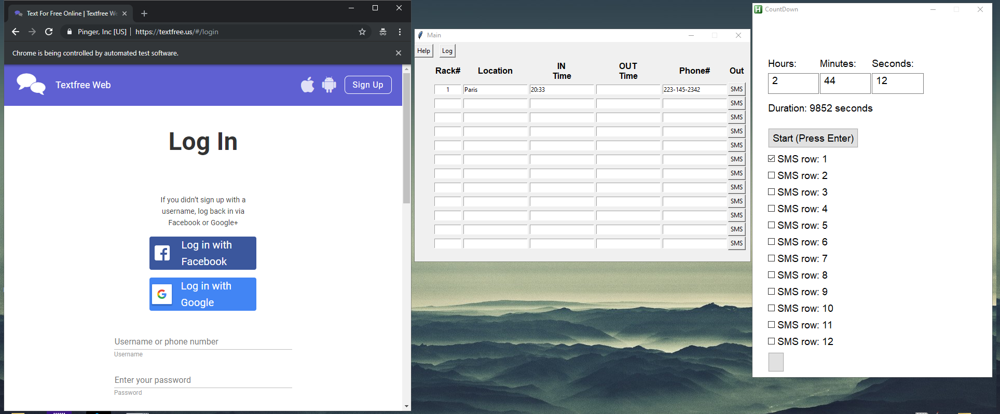

<h1> Textfree Automation </h1>

Current version: https://www.dropbox.com/sh/i1vfq3kfyl9me1q/AABnMjEKDQyeDzmacQhZ0rL9a?dl=0
     
https://textfree.us

     
<h2>Requirements:</h2>
<li>Main.exe</li>
<li>Timer.exe</li>
<li>http://chromedriver.chromium.org/downloads</li>
<li>Chrome driver exe downloaded and added to path</li>
<li>Allow program through firewall when you launch it if it asks</li>
     
<h3>Setting up Chrome webdriver on windows</h3>
<h4>go to download page on http://chromedriver.chromium.org/downloads and choose latest release from there a screen will appear with multiple download links, pick chromedriver_win32.zip. Your browser will download a zip file, extract it and add the .exe file to your PATH.</h4>
<h4>
If you don’t know how to add an executable to the PATH on Windows, check this link out:
<li>
https://www.youtube.com/watch?v=dz59GsdvUF8
</li>

</h4>
